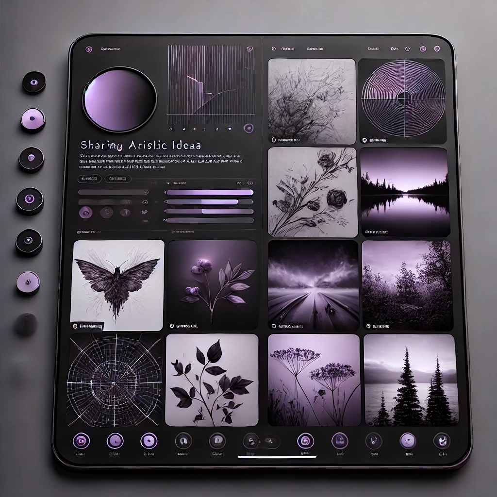

# Imaginarium

Imaginarium is a vibrant and inclusive digital platform designed to celebrate and foster imagination and creativity. It serves as a collaborative space where individuals from all walks of life can share their innovative ideas, artistic expressions, and creative projects.
<p align="center">
 
</p>

## 🔺Live Demo
- https://imaginarium-app.vercel.app/ <br>

## Features

- **User Authentication**: Secure user sign-up and login with Appwrite.
- **Image Posting**: Users can upload and edit images on their profile.
- **Post Interactions**: Like and save images of other users.
- **Post Editing**: Users can edit their own posts.
- **Real-time Updates**: View other users' latest posts and interactions.
- **Responsive Design**: Optimized for both desktop and mobile views.

## Tech Stack

- **ReactJS**: Frontend framework for building user interfaces.
- **Tailwind CSS**: Utility-first CSS framework for styling.
- **ShadCN**: For consistent and modern component design.
- **TanStack Query**: For data fetching, caching, and real-time updates.
- **Appwrite**: Backend as a service for authentication, database, and storage.
- **TypeScript**: Ensures type safety and enhanced code maintainability.

## Why Imaginarium?
- **Unleashing Creativity**: It provides an environment where ideas can flourish without limitations, fostering creativity across all domains.
- **Building Connections**: The platform connects like-minded individuals, creating a network of collaborators and supporters.
- **Celebrating Diversity**: Imaginarium values the uniqueness of every contributor, making it a haven for diverse ideas and perspectives.

This is a [Vite.js](https://vitejs.dev) project bootstrapped with [`$create vite@latest`](https://vitejs.dev/guide/) which is a React.js tool for building Web Applications.

# 🔺Getting Started

First, Fork this repo:

Then, Install NPM:
```bash
npm install
```
Then, start the development server:
```bash
npm run dev
# or
yarn dev
# or
pnpm dev
# or
bun dev
```
Open [http://localhost:5173](http://localhost:5173) with your browser to see the result.


You can start editing the page by modifying `src/main.tsx`. The page auto-updates as you edit the file.
</br>
### To access the Application first signup using Email-Password.
## 📸 Imaginarium-Screenshots




Imaginarium transforms imagination into reality by giving creators a space to dream, share, and innovate. It is more than a platform; it’s a movement to inspire the world through boundless creativity.
